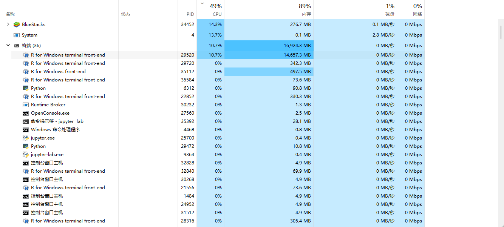
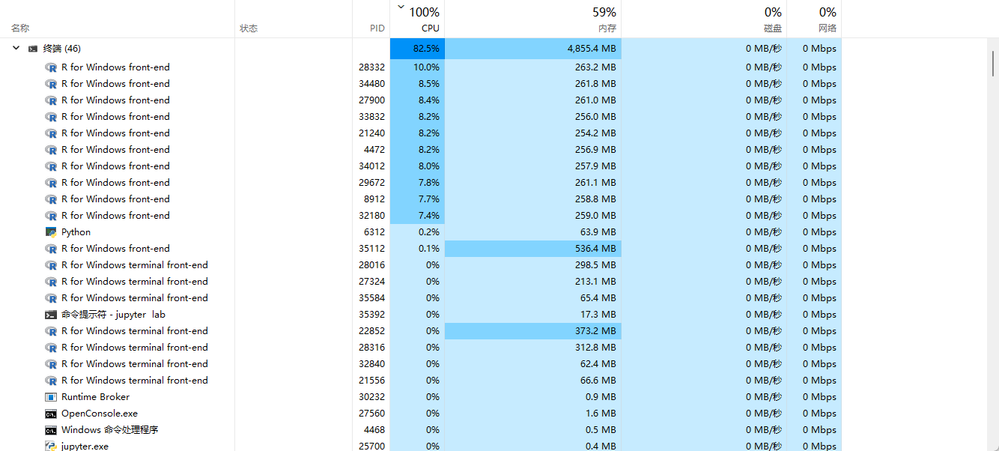

# FASTcure <!-- omit in toc -->
An R-package for Estimating Semiparametric PH Cure Models. Optimized for big data.

**Table of Contents**
- [1. Motivation](#1-motivation)
- [2. Modification](#2-modification)
  - [2.1. Efficiency](#21-efficiency)
  - [2.2. Bug fix](#22-bug-fix)
- [3. Simulation result](#3-simulation-result)
- [4. Todos](#4-todos)


## 1. Motivation
Existing R-packages for estimating PH Cure Models are very inefficient and quite buggy, so I modify the original package [smcure](https://cran.r-project.org/web/packages/smcure/index.html) just to make it faster and more reliable (hopefully).

## 2. Modification
### 2.1. Efficiency
As you can see, when you feed too much data to smcure (in this case, I feed a `34, 008` row dataframe to it), it will consume a significant amount of memory (up to 14 GB !). Besides, `smcure` will only utilize one cpu core when performs bootstrap steps, even if your new PC or powerful server has many cpu cores !



After profiling smcure, I found this function consume the most CPU time:

```R
smsurv <-
function(Time,Status,X,beta,w,model){    
    death_point <- sort(unique(subset(Time, Status==1)))
	if(model=='ph') coxexp <- exp((beta)%*%t(X[,-1]))  
    lambda <- numeric()
    event <- numeric()
      for(i in 1: length(death_point)){
       event[i] <- sum(Status*as.numeric(Time==death_point[i]))
                 if(model=='ph')  temp <- sum(as.numeric(Time>=death_point[i])*w*drop(coxexp))
       		if(model=='aft')  temp <- sum(as.numeric(Time>=death_point[i])*w)
                  temp1 <- event[i]
       lambda[i] <- temp1/temp
        }
    HHazard <- numeric()
    for(i in 1:length(Time)){
        HHazard[i] <- sum(as.numeric(Time[i]>=death_point)*lambda)
        if(Time[i]>max(death_point))HHazard[i] <- Inf
        if(Time[i]<min(death_point))HHazard[i] <- 0
        }
   survival <- exp(-HHazard)
   list(survival=survival)
}
```

There are two main reasons why this function is slow:

- Frequent GC: this expression `lambda <- numeric()` create an vector and subsequent code dynamically grows its size, which invokes too many memory allocation system call.
- Nested loop: when your data has many rows, the two `for` loops inside this function can be quite slow.

To fix these issues, I rewrite this funciton in C++ (`haz.cpp` and `cumhaz.cpp`) using [Rcpp](https://cran.r-project.org/web/packages/Rcpp/index.html) library and use [foreach](https://cran.r-project.org/web/packages/foreach/index.html) package to parallize bootstrap steps.

The following screenshot shows that after optimization, you can use all of your cpu cores and there's a significant reduction in memory usage (and GC frequence, which is not shown here)



### 2.2. Bug fix
#### factor variable in incidence model

```R
cvars <- all.vars(cureform)
Z <- as.matrix(cbind(rep(1,n),data[,cvars]))
colnames(Z) <- c("(Intercept)",cvars)
```

In this code block, `as.matrix` will convert dataframe to matrix, but if your dataframe contains factor variables, `as.matrix` will convert the whole dataframe to string matrix (because matrix can hold exactly one type of data), this behaviour will cause subsequent code crashes:

```R
b <- eval(parse(text = paste("glm", "(", "w~Z[,-1]",",family = quasibinomial(link='", link, "'",")",")",sep = "")))$coef
```

So I use `model.matrix` to extract covariates.

#### One covariate problem

When you specify only one covariate in submodels like the following code:

```R
smcure(formula = Surv(time, cancer) ~ stage)
```
smcure will crash with error: `non-conformable arguments`, this problem is due to the following expression in `smsurv` function:

```R
exp(X[, -1] %*% beta)
```

When X has only two columns, `X[, -1]` will produce an atomic vector instead of a matrix, this behaviour will cause `non-conformable arguments` error. So you should add `dim` attribute to this vector to make it a matrix.

## 3. Simulation result
`n=300, nsims = 500` 


## 4. Todos

- better std.error estimation method
- testing AFT model
- 

